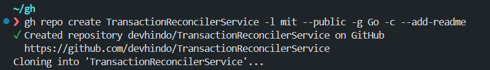
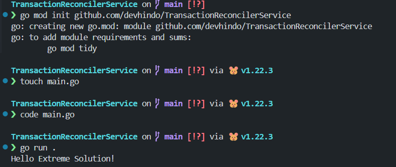
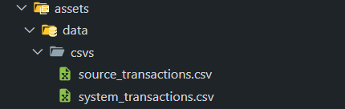

# TransactionReconcilerService

This project is a Go-based service for reconciling transactions. It is designed to be a simple and efficient solution for managing transaction data. It's part of the initial step towards joining the Extreme Solution team as a backend developer.

## Project Creation

Using `gh` cli tool:

## Project Configuration

- Initializing Go project:

## Adding the CSVs files

## Created the necessary data structures used across the service

seen in [models/transaction.go](./models/transaction.go)